# Sơ Đồ Quy Trình Nghiệp Vụ BPMN - Du Lịch Quảng Bá

> Biểu đồ BPMN tổng quát thể hiện toàn bộ quy trình nghiệp vụ của hệ thống Du Lịch Quảng Bá.

---

## Biểu Đồ BPMN Tổng Quát

```mermaid
flowchart TD
    %% ==================== START ====================
    START([Bắt đầu]) --> LANDING
    
    %% ==================== PUBLIC AREA ====================
    subgraph PUBLIC["VÙNG CÔNG KHAI"]
        LANDING([Trang chủ]) --> BROWSE{Hướng dẫn<br/>khách hàng}
        BROWSE --> DEST{Hướng dẫn<br/>đến điểm đến?}
        DEST -->|Có| DEST_LIST[Xem danh sách<br/>điểm đến]
        DEST -->|Không| TOUR_Q{Tour<br/>phù hợp?}
        TOUR_Q -->|Có| TOUR_LIST[Xem danh sách<br/>tour]
        TOUR_Q -->|Không| ARTICLE_Q{Bài viết<br/>hữu ích?}
        ARTICLE_Q -->|Có| ARTICLE_LIST[Xem danh sách<br/>bài viết]
        ARTICLE_Q -->|Không| RECOMMEND{Quy trình<br/>gợi ý?}
        RECOMMEND -->|Có| REC_SYSTEM[Gợi ý điểm đến<br/>theo sở thích]
        RECOMMEND -->|Không| CHATBOT{Quy trình<br/>chatbot?}
        CHATBOT -->|Có| CHAT_FLOW[Chatbot hỗ trợ<br/>tự động]
        CHATBOT -->|Không| AUTH_CHECK
        
        DEST_LIST --> FILTER_D{Lọc &<br/>Tìm kiếm?}
        FILTER_D -->|Có| APPLY_DEST_FILTER[Áp dụng bộ lọc]
        APPLY_DEST_FILTER --> DEST_LIST
        FILTER_D -->|Không| VIEW_DEST_DETAIL[Xem chi tiết<br/>điểm đến]
        
        TOUR_LIST --> FILTER_T{Lọc &<br/>Tìm kiếm?}
        FILTER_T -->|Có| APPLY_TOUR_FILTER[Áp dụng bộ lọc]
        APPLY_TOUR_FILTER --> TOUR_LIST
        FILTER_T -->|Không| VIEW_TOUR_DETAIL[Xem chi tiết<br/>& lịch trình tour]
        
        ARTICLE_LIST --> FILTER_A{Lọc &<br/>Tìm kiếm?}
        FILTER_A -->|Có| APPLY_ART_FILTER[Áp dụng bộ lọc]
        APPLY_ART_FILTER --> ARTICLE_LIST
        FILTER_A -->|Không| VIEW_ART_DETAIL[Xem chi tiết<br/>bài viết]
        
        VIEW_DEST_DETAIL --> D_AUTH{Đăng nhập?}
        VIEW_TOUR_DETAIL --> T_AUTH{Đăng nhập?}
        VIEW_ART_DETAIL --> A_AUTH{Đăng nhập?}
        
        D_AUTH -->|Không| REDIRECT1[Chuyển hướng<br/>đăng nhập]
        T_AUTH -->|Không| REDIRECT2[Chuyển hướng<br/>đăng nhập]
        A_AUTH -->|Không| REDIRECT3[Chuyển hướng<br/>đăng nhập]
    end
    
    %% ==================== AUTHENTICATION ====================
    subgraph AUTH["XÁC THỰC & ỦY QUYỀN"]
        AUTH_CHECK{Loại<br/>người dùng?}
        
        AUTH_CHECK -->|Khách| AUTH_GUEST{Thực hiện<br/>thao tác?}
        AUTH_GUEST -->|Đăng ký| REGISTER[Đăng ký tài khoản]
        REGISTER --> VAL_REG{Validate<br/>dữ liệu?}
        VAL_REG -->|Không| REG_ERR[Thông báo lỗi]
        REG_ERR --> REGISTER
        VAL_REG -->|Có| HASH_P[Hash mật khẩu]
        HASH_P --> SAVE_U[Lưu user]
        SAVE_U --> REG_OK[Đăng ký thành công]
        REG_OK --> LOGIN_P[Đăng nhập]
        
        AUTH_GUEST -->|Đăng nhập| LOGIN_P
        AUTH_CHECK -->|Đã đăng nhập| ROLE_CHECK{Vai trò?}
        
        LOGIN_P --> GET_CREDS[Nhập email/password]
        GET_CREDS --> CHECK_CREDS{Xác thực<br/>thông tin?}
        CHECK_CREDS -->|Sai| AUTH_ERR[Thông báo lỗi<br/>đăng nhập]
        AUTH_ERR --> GET_CREDS
        CHECK_CREDS -->|Đúng| GEN_TOKEN[Tạo JWT token]
        GEN_TOKEN --> AUTH_SUCCESS[Đăng nhập thành công]
        AUTH_SUCCESS --> ROLE_CHECK
    end
    
    %% ==================== USER FUNCTIONS ====================
    subgraph USER["CHỨC NĂNG NGƯỜI DÙNG"]
        ROLE_CHECK -->|User| USER_FLOW
        
        USER_FLOW --> BOOKING{Đặt<br/>tour?}
        BOOKING -->|Có| CHECK_AVAIL{Kiểm tra<br/>số chỗ?}
        CHECK_AVAIL -->|Hết chỗ| NO_AVAIL[Thông báo<br/>hết chỗ]
        NO_AVAIL --> DEST
        CHECK_AVAIL -->|Còn| FILL_BOOKING[Nhập thông tin<br/>đặt tour]
        FILL_BOOKING --> VAL_BOOK{Validate<br/>dữ liệu?}
        VAL_BOOK -->|Không| BOOK_ERR[Thông báo lỗi]
        BOOK_ERR --> FILL_BOOKING
        VAL_BOOK -->|Có| CHECK_DATE{Kiểm tra<br/>ngày hợp lệ?}
        CHECK_DATE -->|Quá khứ| DATE_ERR[Thông báo<br/>ngày không hợp lệ]
        DATE_ERR --> FILL_BOOKING
        CHECK_DATE -->|Hợp lệ| PAYMENT[Thanh toán]
        PAYMENT --> PAY_OK{Xử lý<br/>thành công?}
        PAY_OK -->|Không| PAY_ERR[Thông báo<br/>thanh toán thất bại]
        PAY_ERR --> PAYMENT
        PAY_OK -->|Có| CREATE_BOOK[Tạo booking]
        CREATE_BOOK --> SEND_CONF[Gửi xác nhận]
        SEND_CONF --> BOOK_SUCCESS[Đặt tour<br/>thành công]
        BOOK_SUCCESS --> VIEW_HISTORY[Xem lịch sử<br/>đặt tour]
        
        BOOKING -->|Không| REVIEW_ACT{Đánh giá /<br/>Bình luận?}
        REVIEW_ACT -->|Có| SELECT_TYPE{Loại<br/>đánh giá?}
        SELECT_TYPE -->|Điểm đến| RATING_INPUT[Nhập rating 1-5 sao<br/>& bình luận]
        SELECT_TYPE -->|Tour| TOUR_REVIEW[Nhập đánh giá tour]
        SELECT_TYPE -->|Bài viết| ART_REVIEW[Nhập bình luận<br/>bài viết]
        
        RATING_INPUT --> VAL_RATING{Validate<br/>rating?}
        VAL_RATING -->|Không 1-5| RATING_ERR[Thông báo lỗi]
        RATING_ERR --> RATING_INPUT
        VAL_RATING -->|Hợp lệ| CHECK_DUP{Kiểm tra<br/>đánh giá trùng?}
        CHECK_DUP -->|Trùng| DUP_ERR[Thông báo<br/>đã đánh giá]
        DUP_ERR --> DEST
        CHECK_DUP -->|Không| SAVE_REVIEW[Đánh giá được lưu]
        SAVE_REVIEW --> UPDATE_AVG[Cập nhật rating<br/>trung bình]
        
        TOUR_REVIEW --> VAL_TOUR_REV[Validate dữ liệu] --> SAVE_TOUR_REV[Lưu đánh giá tour]
        ART_REVIEW --> VAL_ART_REV[Validate độ dài] --> SAVE_ART_REV[Lưu bình luận]
        
        REVIEW_ACT -->|Không| FAV_ACT{Yêu<br/>thích?}
        FAV_ACT -->|Có| TOGGLE_FAV[Toggle yêu thích<br/>điểm đến]
        TOGGLE_FAV --> CHECK_EXIST{Đã yêu<br/>thích?}
        CHECK_EXIST -->|Không| ADD_FAV[Thêm vào<br/>danh sách yêu thích]
        CHECK_EXIST -->|Có| REMOVE_FAV[Xóa khỏi<br/>yêu thích]
        ADD_FAV --> FAV_SAVED[Lưu thành công]
        REMOVE_FAV --> FAV_SAVED
        FAV_SAVED --> VIEW_FAV[Xem danh sách<br/>yêu thích]
        
        FAV_ACT -->|Không| INQUIRY_ACT{Liên hệ /<br/>Tư vấn?}
        INQUIRY_ACT -->|Có| FILL_INQUIRY[Nhập biểu mẫu<br/>liên hệ]
        FILL_INQUIRY --> VAL_INQ{Validate<br/>dữ liệu?}
        VAL_INQ -->|Không| INQ_ERR[Thông báo lỗi]
        INQ_ERR --> FILL_INQUIRY
        VAL_INQ -->|Có| SAVE_INQ[Lưu liên hệ]
        SAVE_INQ --> SEND_AUTO[Gửi xác nhận<br/>tự động]
        SEND_AUTO --> INQ_SENT[Liên hệ<br/>đã gửi]
        
        INQUIRY_ACT -->|Không| PROFILE_ACT{Hồ sơ &<br/>Cài đặt?}
        PROFILE_ACT -->|Có| EDIT_PROFILE[Chỉnh sửa<br/>thông tin cá nhân]
        EDIT_PROFILE --> UPDATE_PROFILE[Cập nhật profile]
        UPDATE_PROFILE --> PROFILE_OK[Thông tin<br/>được cập nhật]
        
        ROLE_CHECK -->|Admin| ADMIN_FLOW
    end
    
    %% ==================== ADMIN FUNCTIONS ====================
    subgraph ADMIN["CHỨC NĂNG QUẢN TRỊ"]
        ADMIN_FLOW --> ADMIN_DASH{Chọn chức năng<br/>quản trị?}
        
        ADMIN_DASH -->|Quản lý<br/>điểm đến| DEST_MGMT
        ADMIN_DASH -->|Quản lý<br/>tour| TOUR_MGMT
        ADMIN_DASH -->|Quản lý<br/>bài viết| ARTICLE_MGMT
        ADMIN_DASH -->|Quản lý<br/>người dùng| USER_MGMT
        ADMIN_DASH -->|Quản lý<br/>liên hệ| INQ_MGMT
        ADMIN_DASH -->|Thống kê| STATS[Xem thống kê<br/>dashboard]
        
        %% Destination Management
        DEST_MGMT --> DEST_OP{Chọn<br/>thao tác?}
        DEST_OP -->|Tạo mới| CREATE_DEST[Nhập thông tin<br/>điểm đến mới]
        CREATE_DEST --> UPLOAD_DEST_IMG[Tải lên<br/>nhiều hình ảnh]
        UPLOAD_DEST_IMG --> VAL_DEST{Validate<br/>dữ liệu?}
        VAL_DEST -->|Không| DEST_ERR[Thông báo lỗi]
        DEST_ERR --> CREATE_DEST
        VAL_DEST -->|Có| SAVE_DEST_ADMIN[Lưu điểm đến]
        SAVE_DEST_ADMIN --> DEST_OK[Thông báo<br/>tạo thành công]
        DEST_OK --> DEST_OP
        
        DEST_OP -->|Chỉnh sửa| EDIT_DEST[Chỉnh sửa<br/>thông tin]
        EDIT_DEST --> UPLOAD_DEST_IMG
        
        DEST_OP -->|Xóa| DEL_DEST{Xác nhận<br/>xóa?}
        DEL_DEST -->|Hủy| DEST_OP
        DEL_DEST -->|Xác nhận| CHECK_REF{Kiểm tra<br/>ràng buộc?}
        CHECK_REF -->|Có| REF_ERR[Thông báo lỗi<br/>Không thể xóa]
        REF_ERR --> DEST_OP
        CHECK_REF -->|Không| DELETE_DEST_ADMIN[Xóa điểm đến]
        DELETE_DEST_ADMIN --> DEST_DEL_OK[Thông báo<br/>xóa thành công]
        DEST_DEL_OK --> DEST_OP
        
        %% Tour Management
        TOUR_MGMT --> TOUR_OP{Chọn<br/>thao tác?}
        TOUR_OP -->|Tạo mới| CREATE_TOUR[Nhập thông tin tour]
        CREATE_TOUR --> ADD_SCHEDULE[Thêm lịch trình] --> VAL_TOUR{Validate?} -->|Không| TOUR_ERR[Lỗi] --> CREATE_TOUR
        VAL_TOUR -->|Có| SAVE_TOUR_ADMIN[Lưu tour] --> TOUR_OK[Thành công] --> TOUR_OP
        TOUR_OP -->|Chỉnh sửa| EDIT_TOUR[Chỉnh sửa tour] --> CREATE_TOUR
        TOUR_OP -->|Xóa| DEL_TOUR[Xóa tour] --> TOUR_OP
        TOUR_OP -->|Cập nhật trạng thái| UPDATE_BOOKING_STATUS[Cập nhật trạng thái<br/>booking]
        
        %% Article Management
        ARTICLE_MGMT --> ART_OP{Chọn<br/>thao tác?}
        ART_OP -->|Tạo mới| CREATE_ART[Soạn bài viết<br/>& tải nhiều ảnh]
        CREATE_ART --> SET_FEATURED{Đặt<br/>nổi bật?} --> VAL_ART{Validate?} -->|Không| ART_ERR[Lỗi] --> CREATE_ART
        VAL_ART -->|Có| PUB_STATUS{Xuất bản<br/>ngay?}
        PUB_STATUS -->|Có| PUBLISH_ART[Xuất bản bài viết]
        PUB_STATUS -->|Không| SAVE_DRAFT_ART[Lưu nháp]
        PUBLISH_ART --> SAVE_ART_ADMIN[Lưu bài viết] --> ART_OK[Thành công] --> ART_OP
        SAVE_DRAFT_ART --> ART_OK
        ART_OP -->|Chỉnh sửa| EDIT_ART[Chỉnh sửa bài viết] --> CREATE_ART
        ART_OP -->|Xóa| DELETE_ART[Xóa bài viết] --> ART_OP
        
        %% User Management
        USER_MGMT --> USER_LIST[Xem danh sách<br/>người dùng]
        USER_LIST --> USER_OP{Chọn<br/>thao tác?}
        USER_OP -->|Bật/Tắt| TOGGLE_USER[Toggle trạng thái<br/>hoạt động]
        TOGGLE_USER --> CHECK_SELF{Kiểm tra<br/>tự khóa?}
        CHECK_SELF -->|Tự khóa| SELF_ERR[Thông báo<br/>Không thể tự khóa]
        SELF_ERR --> USER_OP
        CHECK_SELF -->|Không| UPDATE_USER_STATUS[Cập nhật trạng thái]
        UPDATE_USER_STATUS --> USER_OP
        
        USER_OP -->|Xem chi tiết| VIEW_USER_DETAIL[Xem chi tiết user] --> USER_LIST
        USER_OP -->|Xóa| DELETE_USER[Xóa user] --> USER_LIST
        
        %% Inquiry Management
        INQ_MGMT --> INQ_LIST[Xem danh sách<br/>liên hệ]
        INQ_LIST --> INQ_OP{Chọn<br/>thao tác?}
        INQ_OP -->|Xem chi tiết| VIEW_INQ[Chi tiết liên hệ] --> INQ_LIST
        INQ_OP -->|Trả lời| REPLY_INQ[Nhập nội dung<br/>trả lời]
        REPLY_INQ --> VAL_REPLY{Validate<br/>nội dung?}
        VAL_REPLY -->|Trống| REPLY_ERR[Thông báo lỗi]
        REPLY_ERR --> REPLY_INQ
        VAL_REPLY -->|Có| SEND_REPLY_EMAIL[Gửi email trả lời]
        SEND_REPLY_EMAIL --> UPDATE_INQ_STATUS[Cập nhật trạng thái<br/>Đã trả lời] --> INQ_LIST
    end
    
    %% ==================== CONNECTIONS ====================
    REDIRECT1 & REDIRECT2 & REDIRECT3 --> LOGIN_P
    AUTH_SUCCESS --> DEST
    
    %% ==================== END STATES ====================
    BOOK_SUCCESS & FAV_SAVED & INQ_SENT & PROFILE_OK & STATS --> END_USER1([Kết thúc<br/>người dùng])
    DEST_OK & DEST_DEL_OK & TOUR_OK & ART_OK & UPDATE_USER_STATUS & INQ_LIST --> END_ADMIN([Kết thúc<br/>quản trị])
    
    %% ==================== STYLES ====================
    style START fill:#27ae60,stroke:#27ae60,color:#fff
    style END_USER1 fill:#e74c3c,stroke:#e74c3c,color:#fff
    style END_ADMIN fill:#e74c3c,stroke:#e74c3c,color:#fff
    
    style LANDING fill:#3498db,stroke:#3498db,color:#fff
    style AUTH_CHECK fill:#9b59b6,stroke:#9b59b6,color:#fff
    
    style PUBLIC fill:#ecf0f1,stroke:#bdc3c7
    style AUTH fill:#ffeaa7,stroke:#fdcb6e
    style USER fill:#d5f5e3,stroke:#27ae60
    style ADMIN fill:#fadbd8,stroke:#e74c3c
```



---

## Danh sách các phần tử BPMN

### Sự kiện (Events)

| Ký hiệu | Tên | Mô tả |
|----------|------|--------|
| `(O)` | Bắt đầu | Khách hàng truy cập trang chủ |
| `([ ])` | Kết thúc | Hoàn thành quy trình |

### Hoạt động (Activities)

| Hoạt động | Mô tả | Phân vùng |
|------------|--------|-----------|
| Trang chủ | Điểm khởi đầu cho mọi hành động | PUBLIC |
| Đăng ký / Đăng nhập | Xác thực người dùng | AUTH |
| Xem danh sách điểm đến/tour/bài viết | Duyệt nội dung | PUBLIC |
| Xem chi tiết | Xem thông tin chi tiết | PUBLIC |
| Đặt tour | Tạo booking | USER |
| Đánh giá / Bình luận | Tạo nội dung phản hồi | USER |
| Yêu thích | Quản lý danh sách yêu thích | USER |
| Liên hệ | Gửi yêu cầu hỗ trợ | USER |
| CRUD điểm đến/tour/bài viết | Quản lý nội dung | ADMIN |
| Quản lý người dùng | Quản lý tài khoản | ADMIN |
| Dashboard thống kê | Xem báo cáo | ADMIN |

### Cổng xử lý (Gateways)

| Gateway | Loại | Mô tả |
|---------|------|--------|
| `{}` | XOR Gateway | Rẽ nhánh theo điều kiện |
| `<>` | Parallel Gateway | Xử lý song song (nếu cần) |

### Luồng (Flows)

| Luồng | Mô tả |
|--------|--------|
| `-->` | Luồng tuần tự mặc định |
| `-->|--> | Luồng có điều kiện |

---

## Mô tả chi tiết các quy trình con

### 1. Quy trình Xác thực

```
START → Trang chủ → Chọn đăng nhập/đăng ký
         ↓
    [Khách chưa có tài khoản] → Đăng ký → Validate → Hash password → Lưu → Thành công
         ↓
    [Khách có tài khoản] → Đăng nhập → Xác thực credentials
         ↓
    Thành công → Tạo JWT → Phân quyền (User/Admin)
         ↓
    Thất bại → Thông báo lỗi → Quay lại nhập
```

### 2. Quy trình Đặt Tour

```
Xem tour → Chọn tour → Kiểm tra số chỗ
    ↓
[Số chỗ = 0] → Thông báo hết chỗ → Quay lại
    ↓
[Số chỗ > 0] → Nhập thông tin đặt tour
    ↓
Validate dữ liệu → Kiểm tra ngày hợp lệ → Thanh toán
    ↓
[Thanh toán thành công] → Tạo booking → Gửi xác nhận → Hoàn thành
    ↓
[Thanh toán thất bại] → Quay lại thanh toán
```

### 3. Quy trình Quản lý Nội dung (Admin)

```
Đăng nhập Admin → Dashboard
    ↓
Chọn chức năng: Điểm đến / Tour / Bài viết
    ↓
[Tạo mới] → Nhập dữ liệu → Upload ảnh → Validate → Lưu → Thành công
    ↓
[Chỉnh sửa] → Load dữ liệu → Sửa → Lưu → Thành công
    ↓
[Xóa] → Xác nhận → Kiểm tra ràng buộc → [Có ràng buộc] → Báo lỗi
                                    ↓
                            [Không ràng buộc] → Xóa → Thành công
```

---

## Ghi chú triển khai

- Biểu đồ này thể hiện **tổng quan** toàn bộ quy trình nghiệp vụ
- Các quy trình con được mô tả chi tiết trong phần **Mô tả chi tiết**
- Phân biệt rõ **vùng công khai** (PUBLIC), **vùng xác thực** (AUTH), **vùng người dùng** (USER), và **vùng quản trị** (ADMIN)
- Áp dụng nguyên tắc **phân quyền** dựa trên vai trò (RBAC)

---

*Document được tạo tự động cho hệ thống Du Lịch Quảng Bá*  
*Ngày tạo: 25/05/2026*
